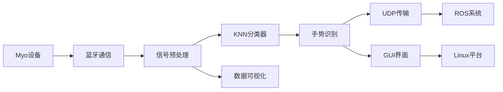

# 龙芯肌电控制仿生手系统

## 目录
- [龙芯肌电控制仿生手系统](#龙芯肌电控制仿生手系统)
  - [目录](#目录)
  - [项目简介](#项目简介)
  - [功能特性](#功能特性)
    - [核心功能](#核心功能)
    - [技术指标](#技术指标)
  - [系统架构](#系统架构)
  - [安装使用指南](#安装使用指南)
    - [环境要求](#环境要求)
    - [安装步骤](#安装步骤)
    - [编译C++扩展](#编译c扩展)
    - [创建Python虚拟环境并安装Python依赖](#创建python虚拟环境并安装python依赖)
    - [运行程序](#运行程序)
    - [使用手册](#使用手册)
      - [设备连接佩戴](#设备连接佩戴)
      - [主界面操作（手势识别界面）](#主界面操作手势识别界面)
      - [数据采集](#数据采集)
      - [肌电信号数据曲线图](#肌电信号数据曲线图)
  - [常见问题](#常见问题)
    - [Q1: 成功安装相关python依赖（numpy）后无法正常import](#q1-成功安装相关python依赖numpy后无法正常import)
    - [Q2: 识别准确率低](#q2-识别准确率低)
  - [贡献指南](#贡献指南)
  - [许可证](#许可证)
  - [联系我们](#联系我们)

---
## 项目简介
本项目是基于Myo肌电臂环的智能手势识别系统，运行于Linux平台（支持LoongArch架构），采用PyQt5构建用户界面，C++实现核心算法KNN，通过KNN分类器实现10种手势的实时识别。系统包含完整的数据采集、训练和可视化模块。
手势识别系统可通过串口，UDP等方式与仿生手进行通信，实现实时控制。

> **运行平台**: Linux (LoongArch架构或x86-64架构)
> 本项目测试使用ATK-DL2k0300开发板
---
## 功能特性
### 核心功能
- 🎯 实时8通道肌电信号采集（200Hz采样率）
- 🤖 10种预设手势识别（握拳/张开/点赞等）
- 📈 动态数据可视化展示
- 💾 训练数据收集与管理
- 🌐 UDP协议通信驱动仿生手

### 技术指标
| 模块 | 性能参数 |
|------|----------|
| **支持平台** | **Linux x86-64/LoongArch** |
| 信号采样频率 | 200Hz |
| 预处理信号频率 | 50Hz |
| 识别延迟 | <0.5s |
| 识别准确率 | >90% |
| 手势支持 | 10种可扩展 |
| 通信协议 | UDP/ UART |
| 手势动作延迟 | <1.5s |

---

---
## 系统架构


## 安装使用指南

### 环境要求
- **操作系统**: Linux 
- **架构支持**: x86-64/LoongArch
- Python 3.12+
- Myo臂环及蓝牙适配器
- Bluez蓝牙协议栈（Linux自带）

> **平台注意**: LoongArch架构需安装龙芯专用Bluez驱动

### 安装步骤
1. 安装系统依赖：
   ```bash
   # Ubuntu/Debian（x86_64）
   sudo apt install libbluetooth-dev libgtk-3-dev liblapack-dev
   ```
   
   > **LoongArch支持**: 
   > ```bash
   >make ARCH=loongarch menuconfig 
   > 在menuconfig界面配置蓝牙和USB_ACM相关选项
   > 重新编译内核后移植到开发板中
   > ```
    >```bash
   > 若只缺少USB_ACM驱动，则可以值只在内核配置中xuan
   > 
   >```

2. 获取源代码：
   ```bash
   git clone https://github.com/Fohen-Wade/ls2k0300_myo.git
   cd ls2k0300_myo
   ```


### 编译C++扩展
在安装有loongson交叉编译工作链的liunx系统中进行编译
（以正点原子linux虚拟机为例）
首先使能编译环境
```bash
source /opt/atk-dl2k0300-toolchain/environment-setup
```
然后使用交叉编译命令
```bash
$CXX -fPIC -shared -O3 -march=loongarch64 -o libknn.so KNN.cpp
或
loongarch64-loongson-linux-gnu-g++ -fPIC -shared -O3 -march=loongarch64 -o libknn.so KNN.cpp
```
将KNN.cpp编译成libknn.so动态链接库，供python程序调用

### 创建Python虚拟环境并安装Python依赖
- 若使用正点原子ATK-DL2k0300开发板，使用以下指令创建并激活python虚拟环境
```bash
python3 -m venv --system-site-packages /home/ls2k0300_myo/ls2k0300_myoV
/home/ls2k0300_myo/ls2k0300_myoV/bin/activate 
``` 
这样虚拟环境中会自带系统中已经安装过的软件包如PyQt5，numpy等
只需要安装如下依赖即可
```bash
pip3 install pyserial
```
- 若所用系统中不自带编译好的python软件包，则使用以下指令创建并激活python虚拟环境
```bash
python3 -m venv /home/ls2k0300_myo/ls2k0300_myoV
/home/ls2k0300_myo/ls2k0300_myoV/bin/activate  
``` 
由于龙芯特殊的架构，若软件包里带C扩展，需要下载预编译后的二进制包，使用以下指令安装
```bash
pip3 install PyQt5 --only-binary=:all: -i https://pypi.loongnix.cn/loongson/pypi --trusted-host pypi.loongnix.cn 
pip3 install numpy --only-binary=:all: -i https://pypi.loongnix.cn/loongson/pypi --trusted-host pypi.loongnix.cn 
pip3 install pyserial
```
具体可参考龙芯官方文档：https://docs.loongnix.cn/python/python.html
- 安装完成后使用如下指令查看已安装列表里是否存在所需依赖
```bash
pip3 list
```
### 运行程序
安装好所需依赖后，确认进入到创建的虚拟环境后，保证在项目文件夹根目录下，执行以下命令，运行程序：
```bash
python3 main.py
```

### 使用手册
#### 设备连接佩戴
- 将蓝牙加密狗插入龙芯开发板USB接口
- 将Myo臂环佩戴在左手或右手小臂（靠近手肘），LED灯朝上

#### 主界面操作（手势识别界面）
- 点击"连接手环"按钮
- 等待手环底部连接指示灯亮起
- 若已经采集过数据，则可以在屏幕看到手势判断结果和数据柱状图


#### 数据采集
- 点击"数据收集"按钮，进入到数据收集界面
- 点击"连接手环"，等待手环连接
- 点击对应手势按钮如"点赞"，同时做出对应手势开始记录对应手势数据
- 点击"暂停记录"可以停止记录，点击另外的手势按钮可以开始下一个手势数据的记录

#### 肌电信号数据曲线图
- 在主页面点击"连接手环"后，点击"查看数据曲线图"即可进入到肌电信号数据曲线图界面，可以实时查看当前采集到的肌电信号数据曲线图
- 可以通过右上角的切换按钮分别查看不同通道的肌电信号数据折线图，也可以同时查看多通道的肌电信号折线图


## 常见问题
### Q1: 成功安装相关python依赖（numpy）后无法正常import 
**出现原因1：**
虚拟环境下的numpy版本与系统的numpy版本冲突，导致无法正常import
**解决方案：**
建立虚拟环境时直接引入系统包
```bash
python3 -m venv --system-site-packages /home/ls2k0300_myo/ls2k0300_myoV
``` 
**出现原因2：**
从龙芯官方下载的python软件包版本不兼容高版本的python，导致无法正常import
**解决方案：**
获取numpy源码，从源码交叉编译得到二进制包，安装
参考：
https://blog.csdn.net/qq_37333800/article/details/136009179?spm=1001.2101.3001.6650.6&utm_medium=distribute.pc_relevant.none-task-blog-2%7Edefault%7EBlogCommendFromBaidu%7ERate-6-136009179-blog-132041971.235%5Ev43%5Epc_blog_bottom_relevance_base7&depth_1-utm_source=distribute.pc_relevant.none-task-blog-2%7Edefault%7EBlogCommendFromBaidu%7ERate-6-136009179-blog-132041971.235%5Ev43%5Epc_blog_bottom_relevance_base7&utm_relevant_index=12

### Q2: 识别准确率低
**建议：**
1. 确保录入数据时的手环的位置与识别时一致，避免因位置不同导致识别准确率低
2. 不同的人使用该系统前需要先进行数据收集，以适应不同人的肌电信号特征


## 贡献指南
**欢迎通过以下方式参与：**
- 提交Pull Request
- 报告Issues
- 改进文档
**代码规范：**
- Python代码遵循PEP8
- C++使用Google风格
- 提交信息格式：
```text
   [类型] 简要描述
    示例: [FIX] 修复设备连接超时问题
```
提交类型说明
|类型标签|	适用场景|
|------|----------|
|[FEAT]	|新增功能|
|[FIX]	|修复缺陷|
|[DOC]	|文档更新|
|[REF]	|代码重构|
|[TEST]|	测试用例|
|[CONF]|	配置变更|
## 许可证
**MIT License  
Copyright (c) 2025 Foehn-Wade  

## 联系我们
- 📧 Email: 2995602161ww@mail.dlut.edu.cn
- 📞 Phone: 19824319953
